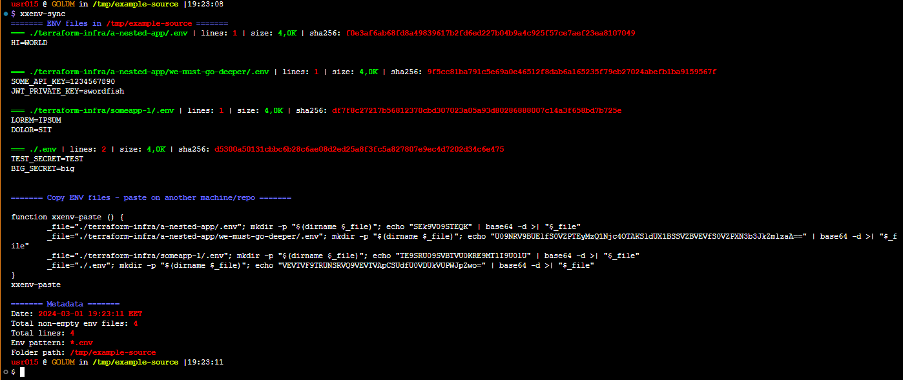
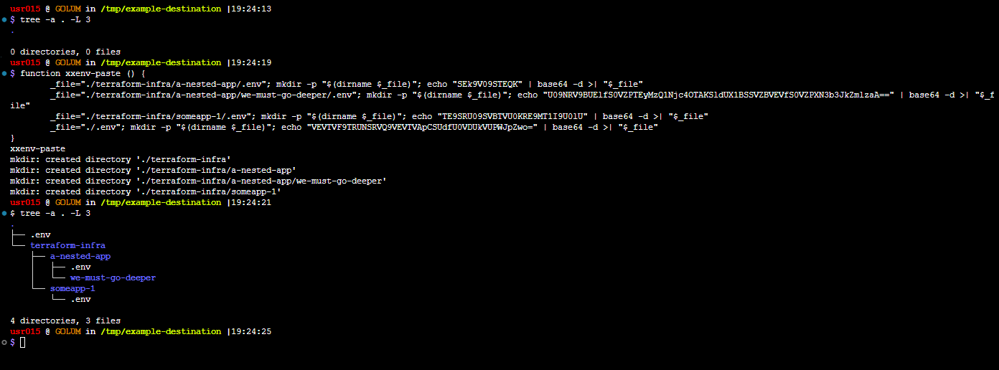

# xxenv-sync

A simple snippet to help sync .env files across repositories and workstations.

When you execute the function, it will get all .env files (pattern is changeable) recursivley from the current directory and generate you command that will copy them at the same place.

The second command you can run in another repository/directory/workstation and the same .env files will be created there.

For an example check the [Usage](#Usage - Linux/Mac) section.

## Usage - Linux/Mac

Put the following snippet in your `~/.bashrc` (or whatever profile or rc method you use) file and reload it:

```bash
function xxenv-sync() {
	local _env_pattern="*.env"
	local _backup_on_paste=false
	local NC="\e[m"
	# Normal Colors
	local Black='\e[0;30m'        # Black
	local Red='\e[0;31m'          # Red
	local Green='\e[0;32m'        # Green
	local Yellow='\e[0;33m'       # Yellow
	local Blue='\e[0;34m'         # Blue
	local Purple='\e[0;35m'       # Purple
	local Cyan='\e[0;36m'         # Cyan
	local White='\e[0;37m'        # White
	# Bold
	local BBlack='\e[1;30m'       # Black
	local BRed='\e[1;31m'         # Red
	local BGreen='\e[1;32m'       # Green
	local BYellow='\e[1;33m'      # Yellow
	local BBlue='\e[1;34m'        # Blue
	local BPurple='\e[1;35m'      # Purple
	local BCyan='\e[1;36m'        # Cyan
	local BWhite='\e[1;37m'       # White
	echo -ne "${BBlue}======= ENV files in${NC} ${BRed}$(pwd)${BBlue} =======${NC}\n"
	env_files=()
	for file in $(find . -name $_env_pattern -type f); do
    echo -ne "${BGreen}=== $file${NC} | lines: ${BRed}$(wc -l "$file" | awk '{print $1}')${NC} | size:${BGreen} $(du -sh $file | awk  '{print $1}')${NC} | sha256: ${BRed}$(sha256sum "$file" | awk '{print $1}')${NC}\n"
	if [ ! -s "$file" ]; then continue; fi
	cat "$file"
	echo -ne "\n\n"
    env_files+=("$file")
  done
  echo -ne "${BBlue}======= Copy ENV files - paste on another machine/repo =======${NC}\n"
  echo ""

  if [ ${#env_files[@]} -eq 0 ]; then echo "All env files are empty. Skipping..."; return; fi

  echo "function xxenv-paste () {"
  for file in "${env_files[@]}"; do
	if [ ! -s "$file" ]; then continue; fi
	if [ "$_backup_on_paste" = true ] && [ -f "$file" ]; then
		echo -ne "	cp \"$file\" \"$file.backup.\$(date +%s).env\"\n"
	fi
	fileContent=$(cat "$file" | base64 -w 0)
	echo -ne "	_file=\"$file\"; mkdir -p \"\$(dirname \$_file)\"; echo \"$fileContent\" | base64 -d >| \"\$_file\";\n"
  done
  echo "};"
  echo -ne "xxenv-paste\n\n"
  echo -ne "${BBlue}======= Metadata =======${NC}\n"
  local _total_env_file_lines
  _total_env_file_lines=$(wc -l < <(printf "%s\n" "${env_files[@]}"))
  echo -ne "Date: ${BRed}$(date "+%Y-%m-%d %H:%M:%S %Z")${NC}\n"
  echo -ne "Total non-empty env files: ${BRed}${#env_files[@]}${NC}\n"
  echo -ne "Total lines: ${BRed}$_total_env_file_lines${NC}\n"
  echo -ne "Env pattern: ${BRed}$_env_pattern${NC}\n"
  echo -ne "Folder path: ${BRed}$(pwd)${NC}\n"
}
```



After that `cd` into a repository (or just a folder) of your choice and run:

```bash
xxenv-sync
```

To replicate the .env files in another repository/directory/workstation, `cd` into it (on the same level as the original one), copy the output command of the previous one from function xxenv-paste to xxenv-paste and run the output command ex.:

```bash
function xxenv-paste () {
        _file="./terraform-infra/a-nested-app/.env"; mkdir -p "$(dirname $_file)"; echo "SEk9V09STEQK" | base64 -d >| "$_file"
        _file="./terraform-infra/a-nested-app/we-must-go-deeper/.env"; mkdir -p "$(dirname $_file)"; echo "U09NRV9BUElfS0VZPTEyMzQ1Njc4OTAKSldUX1BSSVZBVEVfS0VZPXN3b3JkZmlzaA==" | base64 -d >| "$_file"
        _file="./terraform-infra/someapp-1/.env"; mkdir -p "$(dirname $_file)"; echo "TE9SRU09SVBTVU0KRE9MT1I9U0lU" | base64 -d >| "$_file"
        _file="./.env"; mkdir -p "$(dirname $_file)"; echo "VEVTVF9TRUNSRVQ9VEVTVApCSUdfU0VDUkVUPWJpZwo=" | base64 -d >| "$_file"
}
xxenv-paste
```



## Usage - Windows

```bash
# TODO
```

## Roadmap

- [ ] Add Windows support.
- [ ] Test on Mac.
- [ ] Full POSIX compliance.
- [ ] Add support for other shells (zsh, fish, etc).
- [ ] Add parameter for interactive input.
- [ ] Add parameter for single output in base with encode and compress.

